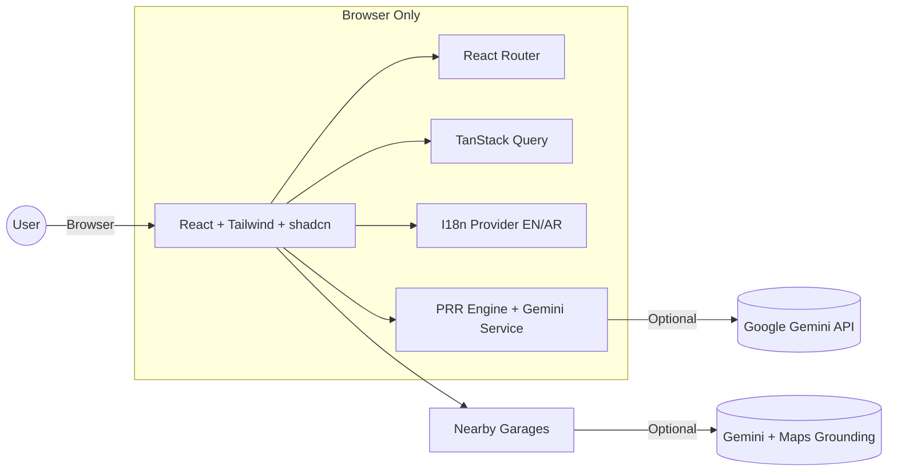

# Smooth Road Ahead — Product & Technical Documentation

Last updated: 2025-11-04

This document is a complete, presentation-ready overview of the “Smooth Road Ahead” app (also branded in the UI as DriveSense/CareCast). Use it as the single source of truth for stakeholders, developers, designers, and presenters.

## 1) Executive Summary

Smooth Road Ahead is a web app that helps drivers stay ahead of vehicle maintenance. It predicts risk, surfaces actionable recommendations, and offers a guided experience with AI chat and voice. The app supports English and Arabic (including RTL), runs entirely in the browser, and integrates with Google Gemini for analysis and location-aware garage suggestions.

- Audience: Individual drivers, family fleets, and small commercial fleets
- Value: Reduce unexpected breakdowns and costs; increase safety and maintenance compliance
- Key Features:
  - Predictive Risk & Repair (PRR) score and alerts
  - AI-powered recommendations (text and simulated streaming; optional voice)
  - Vehicle profile with environmental context (heat, dust, sandstorms)
  - Multilingual UI (EN/AR) with RTL layout
  - Daily check-in and “Discover” feed to keep users engaged
  - Modern dashboard and profile management

## 2) Demo Script (5–8 minutes)

1. Welcome screen
   - Switch language EN/AR; observe RTL change.
   - Click “Get Started”.
2. Onboarding
   - Choose setup (Personal/Family/Commercial), enter basic vehicle details.
3. Dashboard
   - Show Vehicle Health, Upcoming Maintenance, Recent Service, and the new lifestyle dashboard (New Dashboard).
4. Vehicle Profile + PRR
   - Open “Vehicle Profile”, fill VIN, odometer, oil/filter info, environment.
   - Click “Calculate PRR Score”. Show the score and recommendations.
5. AI Chat & Nearby Garages
   - Open “Chat”, ask “Find nearby garages.”
   - If API key is configured, show grounded results; otherwise show the helpful demo fallback text.
6. Discover feed & Daily check-in
   - Show “Discover” recommendations and daily check-in streak.

Tip: If internet/API is restricted, the app still runs entirely in the browser with a deterministic AI fallback (no key needed for basic flows).

## 3) Core Use Cases

- Proactive maintenance: Get a PRR score and prioritized actions before issues escalate.
- Guidance and support: Ask AI for tips, nearby garages, and booking guidance (demo/book flow in UI).
- Multi-language support: Seamless Arabic/English with proper RTL.
- Engagement: Daily check-in, discover feed, and quick actions.

## 4) Features Overview

- Predictive Risk & Repair (PRR)
  - Rules-based calculation enhanced by AI analysis via Gemini
  - Alerts for oil change, dust exposure, thermal stress, etc.
- AI Assistant
  - Text chat with simulated streaming
  - Optional voice support (UI messages and logic prepared)
  - Location-aware responses for nearby garages using Google Maps grounding (when enabled)
- Vehicle Profile
  - VIN, odometer, service dates/mileage, tire/battery age, insurance, zip code
  - Environmental inputs: temperature, heat days >45°C, sandstorm events, dust level
- Dashboards
  - Classic dashboard (maintenance view)
  - “New Dashboard” (daily plans, offers, events, lifestyle)
- Discover Feed
  - “For you” content with save/like and “Why this?” explainer dialog
- Account
  - Profile, language, notifications, preferences
- Accessibility & i18n
  - RTL support and dynamic document dir/lang attributes
  - Clear labels and toast feedback

## 5) Architecture (Frontend SPA)

- App Type: Single Page Application (Vite + React + TypeScript)
- Router: react-router-dom (BrowserRouter, nested routes)
- State/data: React state and TanStack Query for async orchestration
- UI: Tailwind CSS + shadcn/ui + Radix primitives + Lucide icons
- Charts/visuals: Recharts, Embla carousel
- AI/LLM: Google Gemini 2.5 Flash via @google/genai SDK (browser)
- i18n: lightweight provider with EN/AR dictionaries, RTL toggling
- Build: Vite build and preview

### High-level diagram (Mermaid)



Notes:
- The app can run completely client-side. If VITE_GEMINI_API_KEY is not provided, a deterministic fallback is shown.
- For nearby garages, Gemini Maps grounding is attempted; otherwise a helpful generic fallback is returned.

## 6) Data Contracts (Types)

These are the core types used in PRR and chat flows (source: `types.ts`).

- VehicleProfile
  - vin: string
  - odometer: number | ''
  - lastOilChangeDate: string
  - lastOilChangeMileage: number | ''
  - lastAirFilterChangeMiles: number | ''
  - zipCode: string
  - lastServiceDate: string
  - tireAgeMonths: number | ''
  - batteryAgeMonths: number | ''
  - insuranceExpiryDate: string

- EnvironmentalData
  - currentTemperature_C: number | ''
  - daysAbove_45C_Last_90Days: number | ''
  - sandstorm_Events_Last_30Days: number | ''
  - dustLevel: '' | 'low' | 'medium' | 'high'
  - weatherForecastSummary: string

- PredictionResult
  - prrScore: number
  - overallAssessment: string
  - recommendations: { component: string; recommendationText: string; urgency: 'High' | 'Medium' | 'Low' }[]
  - alerts: string[]

## 7) PRR Logic and AI Enhancement

- Rules-based logic (fallback/always available):
  - Sand/dust exposure + miles since air filter change
  - Extreme heat days (>45°C, last 90 days)
  - Oil change interval (months and miles)
- AI-enhanced analysis (when VITE_GEMINI_API_KEY is set):
  - Summarizes overall assessment and crafts prioritized, actionable recommendations
  - Returns strict JSON via responseSchema for resilience
- Graceful demo mode: If no API key, a clear “demo mode” message and useful generic recommendations are provided.

## 8) Routing and Screens

Defined in `src/App.tsx` using BrowserRouter:

- '/': Welcome
- '/onboarding': Onboarding (multi-step)
- '/dashboard': Classic Dashboard
- '/ndashboard': NewDashboard (lifestyle-focused)
- '/chat': DriveSense Chat
- '/account': Account
- '/vehicle-profile': Vehicle Profile
- '/discover': DiscoverFeed (wrapped with ErrorBoundary)
- Catch-all: NotFound

## 9) Tech Stack

- React 18, TypeScript 5, Vite 5
- Tailwind CSS 3, @tailwindcss/typography
- shadcn/ui components (built on Radix UI)
- TanStack React Query 5
- React Router 6
- Recharts, Embla Carousel
- Forms & Validation: react-hook-form, zod
- Icons: lucide-react
- Notifications: sonner + custom Toaster
- AI: @google/genai (Gemini 2.5 Flash)

See `package.json` for the complete list of dependencies.

## 10) Internationalization (EN/AR)

- Language state is stored in localStorage (`language` key) and applied on startup
- Document attributes set: `dir=rtl` for Arabic, `dir=ltr` for English; `lang` set accordingly
- Copy strings live in `src/lib/i18n.tsx` (dictionary-driven)

## 11) Setup and Local Development

Prerequisites:
- Node.js 18+ and npm (or Bun/PNPM if you prefer, but npm scripts are provided)

Environment variables (optional but recommended for full AI features):
- Create a `.env` file in the project root with:

```bash
VITE_GEMINI_API_KEY=your_google_gemini_api_key
```

Install and run (Windows PowerShell):

```powershell
npm install
npm run dev
```

Build and preview:

```powershell
npm run build
npm run preview
```

The app will run locally (default Vite port, typically http://localhost:5173).

## 12) Deployment

- Static hosting (Netlify, Vercel, GitHub Pages, Cloudflare Pages) works well:
  - Build with `npm run build`
  - Deploy the `dist/` folder
- If using Lovable, use Share → Publish
- If using an AI key, set `VITE_GEMINI_API_KEY` in your hosting provider’s environment variables

## 13) Privacy & Security

- No server-side storage in this repo; all logic runs in the browser
- If you provide an API key, the client will call Gemini directly from the browser
  - Consider proxying requests if you need to keep keys server-side (future enhancement)
- Browser permissions used: microphone (voice chat), geolocation (nearby garages)

## 14) Accessibility & UX Notes

- RTL support for Arabic is built-in
- Toast notifications for feedback
- Labels and placeholders provided via i18n dictionaries
- Keyboard navigation and screen-reader behavior inherit from Radix primitives

## 15) Known Limitations

- No backend or database in this repo; service bookings/points are simulated in UI
- Garage search requires API key and location permissions; otherwise a fallback message is shown
- Test suite is not configured yet

## 16) Roadmap (Suggested)

- Backend service for secure AI calls and persistence (profiles, service history)
- Real booking integration (calendar, provider APIs)
- Push notifications/PWA
- More sensors/telematics ingestion for richer PRR model
- A/B tests and analytics dashboards
- E2E and component test coverage (Playwright/React Testing Library)

## 17) Slide Deck Outline (Ready-to-Use)

- Title: Smooth Road Ahead — Predictive Vehicle Care
- Problem → Solution → Outcomes
- Live Demo (5–8 min): Welcome → Onboarding → Dashboard → PRR → Chat → Discover
- Architecture: SPA + Gemini (fallback in demo mode)
- Features Deep Dive (PRR/AI/Multilingual/Engagement)
- Data & Types (VehicleProfile, EnvironmentalData, PredictionResult)
- Privacy/Security & Permissions
- Roadmap and Next Steps
- Q&A

Speaker notes prompts:
- Emphasize EN/AR toggle and RTL as market-ready detail
- Stress the “works offline from AI” demo mode for resilience
- Tie PRR alerts to real-world heat/dust scenarios common in GCC markets

## 18) Appendix

- Key files:
  - `src/App.tsx` — routes and providers
  - `src/lib/geminiService.ts` — PRR score + AI helpers (with demo fallback)
  - `src/lib/i18n.tsx` — dictionaries and I18n provider
  - `types.ts` — core data types
  - `src/pages/*` — screens used in routing
- UI kit: `src/components/ui/*` (shadcn + Radix)
- Styling: Tailwind config in `tailwind.config.ts`

---

This document is meant to be copy-paste friendly for a pitch or product deck. If you’d like, we can auto-generate a slide deck (Markdown → slides) from this file next.
